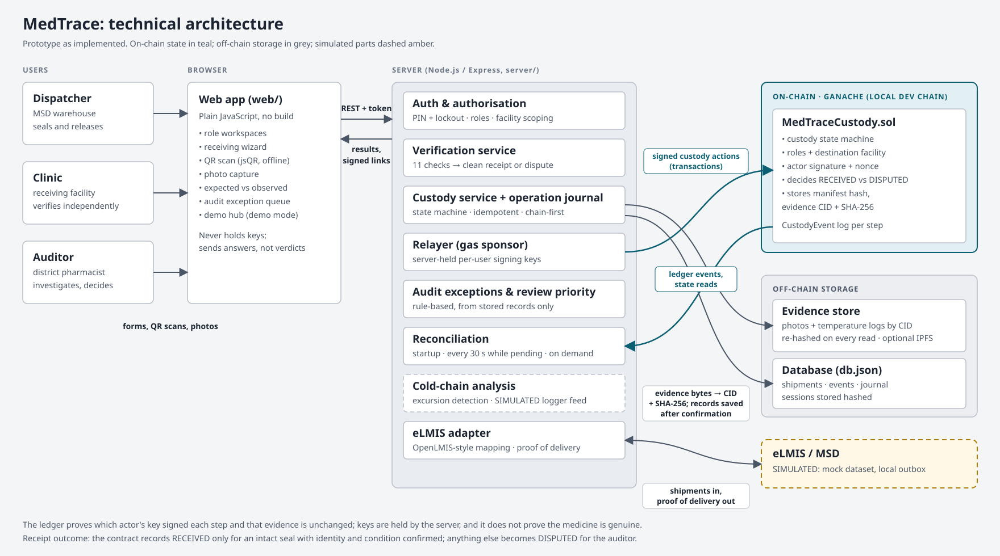

# MedTrace

**Every medical delivery should be verifiable.** MedTrace is an evidence-based custody and integrity platform for medical supplies. It helps health facilities verify deliveries, detect discrepancies, and investigate what happened.

> **Judges:** run `npm install && npm run demo:fresh`, open http://localhost:4000 and choose **Explore the live demo**. Two guided scenarios (a legitimate delivery and a suspicious one) tell you each next step. No PIN is needed. The architecture diagram is in [`docs/`](docs/), and demo credentials are [below](#running-it). The pitch deck and demo video are submitted separately.

Full technical reference: [docs/MedTrace_System_Documentation.md](docs/MedTrace_System_Documentation.md).

## The problem

Medicines released by Tanzania's Medical Stores Department (MSD) through eLMIS can go missing, be swapped or be degraded between the warehouse and the clinic. Proof of delivery is usually a signature on paper. A clinic cannot easily tell whether a sealed package was re-sealed in transit, and an auditor has no reliable trail when something goes wrong.

**Users:**

- **Dispatch officers** at MSD seal and release consignments.
- **Clinic staff** (pharmacy technicians, clinical officers) receive deliveries on a phone or laptop.
- **District pharmacists (auditors)** investigate disputes and decide what happens to the stock.

## What MedTrace does

1. A consignment is imported from eLMIS (mocked here) and registered on a custody ledger (a smart contract).
2. MSD applies numbered tamper seals and prints QR labels. Each label is signed with an HMAC over shipment, package, batch and destination.
3. At the clinic, the receiver:
   - scans the label;
   - answers batch, quantity and condition;
   - **types the number printed on the seal without ever being shown the expected one**;
   - photographs the delivery.
4. A **verification service** turns all of this into explicit checks (`PASS` / `WARNING` / `FAIL` / `NOT_CHECKED`). It then makes one receiving decision:
   - **Clean receipt** only if every mandatory check passes.
   - Anything else becomes **Disputed**: the stock stays in quarantine and goes to the auditor.

   The smart contract makes the same decision independently from the facts it is given.
5. The auditor works from an **exceptions queue** built from real records, with a transparent, rule-based review priority. They review the custody timeline, evidence and ledger references, record an investigation, and accept or reject. The outcome is sent back to eLMIS as proof of delivery.

**Distinctive feature, the cold-chain incident.** Vaccines carry a data-logger record. MedTrace detects excursions outside the product's permitted range, which comes from eLMIS, and shows how long they lasted. It flags the shipment for pharmacist review; it never declares stock unusable on its own. In this demo **the logger feed is simulated and labelled as such everywhere**.

## Architecture



```
 Browser (web/)                 Node/Express server (server/)                         Ganache (local EVM)
 ───────────────                ─────────────────────────────                         ───────────────────
 clinic / dispatch / auditor ─► auth (PIN, lockout, hashed sessions)                   MedTraceCustody.sol
 QR scanning (jsQR, offline)    custody/service.js ── journal ── relayer (chain.js) ─► state machine, roles,
 receiving wizard               custody/verification.js (receiving decision)            signed actions, outcome
 audit queue, timelines         custody/exceptions.js (audit queue, priority)
                                coldchain.js (logs, excursions, SIMULATED feed)
                                evidence.js ──► local IPFS-compatible store (optional Kubo node)
                                integrations/elmis/ (mapper + MOCK source)
                                store.js ──► server/data/db.json (JSON, atomic writes)
```

| Component | Responsibility |
|---|---|
| `contracts/MedTraceCustody.sol` | Custody state machine:<br>CREATED → DISPATCHED → IN_TRANSIT → RECEIPT_PENDING → RECEIVED<br>IN_TRANSIT / RECEIPT_PENDING → DISPUTED → INVESTIGATED → ACCEPTED / REJECTED<br>Every change must be signed by a registered actor and carries a nonce, so it cannot be replayed. Only an approved relayer can submit. The contract decides RECEIVED vs DISPUTED itself. It stores the photo's CID and SHA-256, not the photo. |
| `server/chain.js` | The relayer (pays gas). Simulates each call first for readable errors, signs, **journals the transaction hash before broadcasting**, waits with a timeout, and maps failures to "rejected" (409) or "unavailable" (503). |
| `server/custody/service.js` | All custody operations. Every ledger write goes through one journaled `commit`. The local record changes only after confirmation. Retries are idempotent (`Idempotency-Key`), and reconciliation replays confirmed writes after a crash. |
| `server/custody/verification.js` | The receiving decision and its checks. The preview never compares seal numbers, so the clinic cannot probe for them. |
| `server/custody/exceptions.js` | Auditor exceptions and the rule-based review priority, computed only from stored records. |
| `server/coldchain.js` | Validates temperature logs, detects excursions against a configurable range and tolerance, and generates the SIMULATED demo feed. |
| `server/evidence.js`, `server/evidenceLinks.js` | Content-addressed evidence (CIDv1, the same CID `ipfs add --cid-version=1 --raw-leaves` gives). Every read is re-hashed. Access is through short-lived, per-user signed links. |
| `server/integrations/elmis/` | Adapter between OpenLMIS v3-style payloads and MedTrace consignments, plus proof of delivery. The source is a **mock** dataset. |
| `web/` | Single-page app in plain JavaScript (no build step). jsQR is bundled so scanning works offline. |
| `src/` | The original MetaMask donor dApp, unchanged in behaviour, served at `/legacy/`. It is not connected to custody. |

**Stack:** Solidity 0.8.20, Ganache 7, ethers v5, Node.js ≥ 20 (tested on 22 in CI and 24 locally), Express 4, Node's built-in test runner.

## Running it

**Prerequisites:** Node.js 20 or newer and npm. Nothing else: Ganache is an npm dependency, and the compiled contract is committed.

```bash
npm install
npm run demo:fresh   # local chain + deploy + demo data + server on http://localhost:4000
```

`npm run demo` resumes the existing demo without wiping it. Both commands run in **demo mode**.

Open http://localhost:4000. First-time visitors land on a one-page introduction: the problem, how it works, what is different, and what the record does not prove. **Explore the live demo** opens the demo hub, which offers:

- **Scenario A, a legitimate delivery.** Dispatch it, then receive it: it is RECEIVED.
- **Scenario B, a suspicious delivery.** The seal was swapped in transit: it is DISPUTED, then investigated.
- **Role cards** for exploring freely.
- **Reset demo**, which puts every scenario back at step 1.

Each scenario card shows the package label (QR and code) and what the physical seal reads. Its button signs you into the right role and opens the right page. These steps run the real checks and real ledger writes.

**Demo accounts** exist only in demo mode. The demo hub signs you in without a PIN. To use the login form instead, the accounts are printed in the terminal and listed here; the app never shows them.

| Staff ID | PIN | Role |
|---|---|---|
| `chanika.clinic` | 2222 | Pharmacy technician, Chanika Health Centre |
| `mzinga.clinic` | 3333 | Clinical officer, Mzinga Dispensary |
| `msd.dispatch` | 1111 | Dispatch officer, MSD Dar es Salaam |
| `district.auditor` | 4444 | District pharmacist (auditor) |

**Running the pieces separately:**

```bash
npm run chain                          # Ganache on :7545, state kept in server/data/chain
npm run demo:reset                     # redeploy + reseed (demo mode only, wipes server/data/db.json)
MEDTRACE_DEMO_MODE=1 npm start         # server only
```

**Phone camera:** phones only allow the camera over HTTPS. Create a self-signed certificate and serve over HTTPS:

```bash
openssl req -x509 -newkey rsa:2048 -nodes -days 30 -subj "/CN=medtrace-demo" -keyout key.pem -out cert.pem
MEDTRACE_TLS_CERT=cert.pem MEDTRACE_TLS_KEY=key.pem npm run demo
```

Then open `https://<laptop-ip>:4000` on the phone. Labels can always be typed in instead of scanned.

### Configuration

Copy `.env.example` to `.env`; the file documents every variable. Outside demo mode, **the server refuses to start** until these three secrets are set:

- `RELAYER_PRIVATE_KEY`
- `MEDTRACE_WALLET_MNEMONIC`
- `MEDTRACE_LABEL_SECRET`

The defaults are public demo values, such as Ganache's well-known account #0.

### Contract

The compiled artifact, `build/contracts/MedTraceCustody.json`, is committed, so you don't need a compiler. After editing the contract, rebuild it with a native solc ≥ 0.8.20:

```bash
SOLC=/path/to/solc npm run compile:custody
```

The demo seed deploys both contracts with ethers. A Truffle migration (`migrations/2_deploy_custody.js`) also exists. `npm run test:truffle` needs a node on :7545, and the repository contains no Truffle tests.

### Tests

```bash
npm test             # syntax check of every JS file, then 58 tests (about 25 s)
```

The tests run against an in-process Ganache chain:

| File | Covers |
|---|---|
| `contract.test.js` | Invalid transitions, roles, wrong facility, forged and replayed signatures, unapproved relayer, a damaged seal can't become RECEIVED on chain |
| `api.test.js` | End-to-end receipt scenarios, duplicate and concurrent receipts, wrong or forged QR codes, evidence integrity, eLMIS mapping, ledger rejections and outages, restart, repeatable reset |
| `security.test.js` | Login lockout, no PINs in the UI, signed and expiring evidence links, cross-facility access denied, audit endpoints restricted, no secrets in responses, demo-only features off outside demo mode |
| `verification.test.js` | Decision rules: a valid QR can't override a seal mismatch, missing or tampered evidence fails, the preview can't leak seal numbers, cold chain and expiry handling |
| `reconcile.test.js` | Crash after broadcast is never shown as success and is completed exactly once after restart; lost writes are marked failed and can be retried; events found only on the ledger are recovered and flagged; idempotent retries |
| `coldchain.test.js` | Excursion detection and duration, configurable range and tolerance, log validation, excursion to dispute, a clean log can't replace an excursion |
| `demo.test.js` | Demo hub scenarios expose no PINs; guided Scenario A end to end through the API and contract; demo roles keep their normal permissions; reset restores the starting point and ends all sessions |

CI (`.github/workflows/test.yml`) runs `npm test` on every push.

## Four-minute judge demo

Run `npm run demo:fresh`, open http://localhost:4000, and choose **Explore the live demo**. Press **Reset demo** first if anyone has used it already.

| Time | Do | You should see |
|---|---|---|
| 0:00 | Read the landing page. | The problem, three steps, what is different, and what the record does not prove. |
| 0:30 | **Scenario A**: press *Dispatch it as MSD*. Type seal `MSD-S250007`, then **Record dispatch**. Enter any vehicle, then **Mark in transit**. | Each step reports *submitted and confirmed on the ledger in block N*. The progress strip moves to *In transit*. |
| 1:00 | Back on **Live demo**, press *Receive it as the clinic*, then **Check code**. Answer: batch Yes, quantity 30, condition Good, seal Intact, `MSD-S250007`. Add any photo, then Next. | The label signature is valid for your facility. The preview says **Ready to confirm**, with the seal number *compared when you confirm*. |
| 1:40 | **Confirm receipt**. | **Received: all mandatory checks passed**, and the **Expected vs observed** table is all Pass. |
| 2:00 | **Scenario B**: *Receive it as the clinic*. Answer everything correctly, but type the number the seal shows: `MSD-S240181`. Confirm. | **Disputed: not a clean receipt**. Seal number: expected `MSD-S240118`, observed `MSD-S240181`, Fail. |
| 2:45 | *Investigate as the auditor* (or **Demo guide** → B). | The exception queue (priority 35, the reason), then the record: progress strip, next step, comparison, timeline with ledger blocks, protected photo. |
| 3:20 | **Verify against ledger**. Record findings, then **Reject stock**. | **Verified against the ledger: the record matches**, then **Rejected after investigation**. |

More scenarios (wrong facility, forged label, cold-chain excursion with a simulated logger) are listed under **More scenarios** on the demo page and in [DEMO.md](DEMO.md).

## What is real, what is simulated, what is missing

**Implemented and tested:**

- custody contract and relayer
- signed QR labels
- blind seal-number check
- unified receiving decision
- auditor exception queue and review priority
- protected, integrity-checked evidence
- login lockout
- crash-safe operation journal with reconciliation and idempotent retries
- cold-chain excursion detection
- eLMIS mapping and proof of delivery

**Simulated, and labelled in the UI:**

- **eLMIS.** The data comes from `mock-shipments.json`, and proof of delivery goes to a local outbox (`MOCK-POD-n`). There is no connection to the national eLMIS.
- **Temperature loggers.** No real sensor is integrated. `POST /api/shipments/:id/temperature` accepts real logger uploads, but only the demo simulator produces data today.
- **The blockchain.** It is a local Ganache chain, not a public or permissioned network.

**Not implemented:**

- partial acceptance or returns (the contract only knows RECEIVED vs DISPUTED, and partial acceptance was not faked in the UI)
- offline receiving (drafts survive a refresh, but confirming needs a connection)
- a Kiswahili interface
- notifications (SMS or email)
- reports and exports
- an admin UI for users and facilities (accounts and on-chain actors are created only by the demo seed)
- a database other than the JSON file (single process)
- a Content-Security-Policy (the UI still uses inline handlers)

## Security notes and trust model

**Server-held keys.** Each user's signing key is derived on the server from `MEDTRACE_WALLET_MNEMONIC`. The contract therefore proves that *the MedTrace server* signed on behalf of a logged-in user. It does **not** prove that the person held a key independently. Anyone who controls the server, or that mnemonic, can sign as any user. The design deliberately puts usability, with no wallets on clinic phones, ahead of non-repudiation. Real deployments would need an HSM or KMS for the seed, or user-held keys or passkeys.

**The relayer.** It cannot invent events, because it lacks the actors' keys. It can, however, censor or delay them. The contract owner key can register actors and relayers, and there is no multi-signature control or upgrade path.

**What the evidence proves.** Photos and temperature logs are content-addressed and re-hashed on every read, and the photo hash is anchored on chain. That proves the file is unchanged since upload. It does **not** prove what the photo shows, or that the contents of a package are genuine medicine. The temperature log's hash is stored off-chain only; the contract records just the receipt outcome.

**Demo mode.** `MEDTRACE_DEMO_MODE=1` enables PIN-less sign-in as the synthetic demo accounts, the demo reset (which wipes the database), the demo kit and the simulated temperature feed. All of these return 404 outside demo mode, and tests check that. Never expose a demo-mode server with real data.

**Login.**

- PINs are hashed with scrypt.
- 5 failures lock the staff ID for 5 minutes, and the lock doubles on each further lock.
- Each IP is capped at 30 failures per 15 minutes.
- Lockouts are kept in memory, so a restart clears them.
- Session tokens are stored hashed and expire after 12 hours.

**Evidence links.** They expire after 5 minutes and are bound to one user and one CID. Authorisation is re-checked when a link is used. Responses are sent with `no-store` and `no-referrer`.

**Not done:** a security audit of the contract or the server; TLS by default; CSRF protection is unnecessary for bearer tokens, but no CSP is set. The label HMAC is truncated to 40 bits, which is enough for a demo but short for production.

## Repository layout

```
contracts/      MedTraceCustody.sol (custody), MedicalSupplyDonation.sol (legacy)
server/         API, custody core, verification, exceptions, cold chain, evidence, eLMIS adapter, demo seed
web/            MedTrace web app
src/            legacy MetaMask donor dApp (/legacy/)
scripts/        demo, chain, reset, contract compile, syntax check
test/custody/   test suite
DEMO.md         detailed demo runbook
docs/           system documentation (MedTrace_System_Documentation.md), architecture diagram (SVG + PNG)
```
